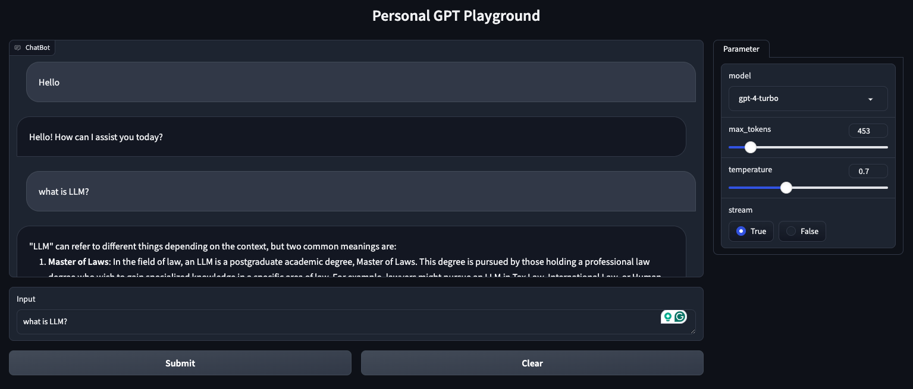

# Personal GPT Playground

This is a [Gradio](https://gradio.app/) based GPT chatbot for conveniently testing SOTA model performance. It leverages OpenAI's GPT models as endpoints and allows a web server interface for interaction. The idea was inspired by a demo from [ChatGLM-6B documentation](https://github.com/THUDM/ChatGLM-6B/blob/main/README_en.md).

## Demo



## How to use it

Setup:

1. Clone repo

   ```shell
   git clone https://github.com/JoKerDii/personal-gpt-playground.git
   cd personal-gpt-playground
   ```

2. Create conda environment and install necessary python packages

   ```shell
   conda create -n py310_gpt_gradio python=3.10
   ```

   ```shell
   conda activate py310_gpt_gradio
   ```

   ```shell
   pip install -r requirements.txt
   ```

2. Create `.env` folder and add OpenAI API key

   ```shell
   echo "OPENAI_API_KEY=sk-*******" | cat > .env
   ```

3. Run `MyGPT.py` to validate API KEY

   ```shell
   python MyGPT.py
   ```

   If successful, you will receive the following response

   ```
   $ python MyGPT.py
   2024-05-11 21:22:19.912 | DEBUG    | __main__:get_response:53 - Hello! How can I assist you today?
   2024-05-11 21:22:19.912 | INFO     | __main__:get_response:54 - Total # of tokens: 17
   Hello! How can I assist you today?
   ```

4. Run `app.py` to initiate the web server

   ```
   python app.py
   ```

